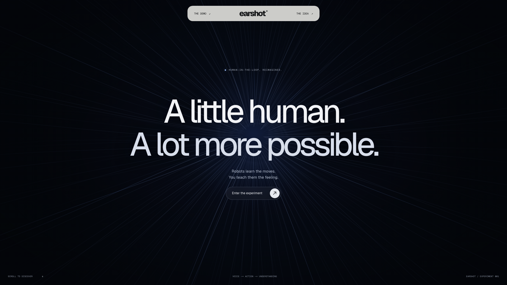
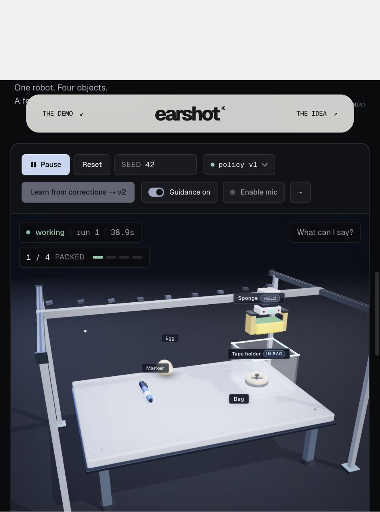
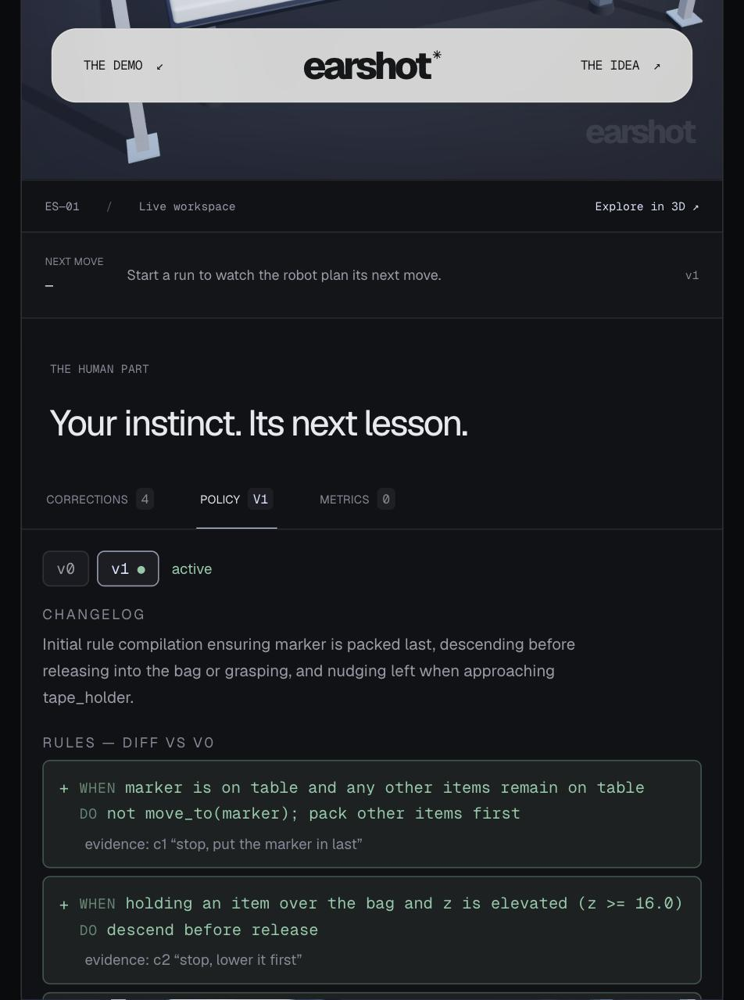

<p align="center">
  
</p>

<h1 align="center">earshot✳</h1>

<p align="center"><strong>The voice supervision layer for autonomous agents.</strong><br>
Say “stop, a bit to the left”. The robot halts in ~300 ms, obeys, logs the correction, and learns it as a rule.<br>
Interventions 4 → 0 on the next run.</p>

<p align="center">
  <a href="https://earshot-virid.vercel.app/#experiment"><strong>Live demo</strong></a> ·
  <a href="#how-it-works">How it works</a> ·
  <a href="#built-on-assemblyai">Built on AssemblyAI</a> ·
  <a href="#run-it-locally">Run it locally</a>
</p>

<p align="center"><em>Entry for the <a href="https://lablab.ai/ai-hackathons/assemblyai-voice-agent-hackathon">AssemblyAI Voice Agent Hackathon</a> (lablab.ai, September 2026).</em></p>

---

## The problem

Every autonomous fleet keeps humans on standby. Waymo told the US Senate it runs about 70 remote assistants for roughly 3,000 vehicles. In robotic warehouses, the humans who handle exceptions decide throughput. Their corrections are the most valuable data those companies own, and today they evaporate the moment the ticket closes.

**Interventions are the KPI everyone reports and nobody learns from.**

## What Earshot does

An operator watches an agent work and talks to it.

| | |
|---|---|
| **Stop** | The word “stop” is caught on AssemblyAI **partial** transcripts, so the agent halts before the sentence is over (~250–300 ms). |
| **Correct** | The rest of the sentence becomes a skill the agent executes now: `nudge(-1.5, 0)`, `squeeze()`, `descend()`, `move_to(tape_holder)`. Grammar first (sub-millisecond), LLM fallback for paraphrases. |
| **Learn** | Every correction is logged with two seconds of prior state and the action the policy was about to take. When the run ends, the corrections are distilled into a new policy version: LLM rules with the quoted sentence as evidence, plus operator facts the skill layer enforces deterministically on every future run. |

Voice is not the interface. It is the training signal.

## The demo

<p align="center"></p>

A simulated gantry gripper packs four objects into a bag. Each object has a quirk the policy cannot perceive but any human can:

| Object | Hidden quirk | What you say |
|---|---|---|
| Tape holder | only lifts by its ring, 2 cm left of the visual centre | **“Stop, a bit to the left.”** |
| Egg | cracks if released from carry height (irreversible) | **“Stop, lower it first.”** (preventive) |
| Sponge | too fat for the bag unless squeezed | **“Stop, squeeze it first.”** |
| Marker | rolls out if anything lands on it | **“Stop, put the marker in last.”** |

Run 1: the base policy fails on all four; you say four sentences; it finishes. The run ends, the robot says “I learned 4 rules.”, the Policy tab types them in. Run 2: same table, nobody talking, 4 / 4 packed with **zero** interventions.

<p align="center"></p>

Measured headless with the real LLM policy and a scripted operator (`pnpm dry-run 42 7 99 123`): every seed completes run 1 with exactly four corrections and run 2 with none. Decisions ≈ 0.7 s, distillation ≈ 2 s.

The **Metrics** tab turns the same numbers into the business reading: interventions per run, operator attention (seconds of human time per run), autonomy (share of the run with nobody attending), and robots one operator could watch at that rate.

## How it works

```
operator voice ─▶ AssemblyAI Universal-3.5 Pro (WebSocket v3)
                    ├─ partial "stop"  ──▶ sim.pause()                     reflex, ~300 ms
                    └─ final sentence  ──▶ grammar | LLM ──▶ skill layer   correction, executed now
                                                             │
high-level policy (LLM, structured output) ──skill──▶ skill layer (frozen, deterministic) ──▶ world
                                                             │
correction log { transcript, 2 s of state, rejected action, outcome }
                    └──▶ distillation (LLM) ──▶ policy v(n+1): rules + evidence + operator facts
```

- **Hierarchical policy.** An LLM chooses one skill at a time from a fixed library (`move_to`, `descend`, `grasp`, `lift`, `release`, `nudge`, `squeeze`, …) given a structured observation. The low-level skill layer is deterministic and never retrained. Learning happens in language. This is the loop Stanford/Berkeley showed on real robots in *Yell At Your Robot* (Shi et al., 2024); Earshot reproduces the loop, not their models.
- **Two halves of learning.** The LLM distills corrections into readable rules (“WHEN holding the sponge above the bag DO squeeze before release — evidence: c3 ‘stop, squeeze it first’”). In parallel, the skill layer derives operator facts from the same corrections (grasp offsets, packing order, lower-before-release, squeeze-before-release) and enforces them on every run under that version, so the learned behaviour does not depend on the model following its own rules.
- **Watchdogs.** If the model stalls, repeats itself or tries to stop early, a deterministic planner takes one step, badged `[override …]` in the HUD. The demo never freezes.
- **The robot talks back.** Browser TTS acknowledges each correction (“Okay, a bit to the left.”, “Marker last, got it.”, “I learned 4 rules.”); the mic is muted while it speaks so its own voice is never transcribed as a correction.

## Built on AssemblyAI

Earshot uses the **Realtime Speech-to-Text** path (bring your own orchestration), because the reflex matters: the robot must not chat, it must obey in a few hundred milliseconds.

| Feature | How Earshot uses it |
|---|---|
| Partial transcripts (`Turn`, `end_of_turn: false`) | the “stop” reflex fires on the first partial that contains a stop word |
| `speech_model=universal-3-5-pro`, `mode=min_latency`, `min_turn_silence=100`, `max_turn_silence=800` | turn detection tuned for short commands, verified against the live API |
| `keyterms_prompt` | robot vocabulary and the demo sentences biased in (“squeeze”, “tape holder”, “put the marker in last”) |
| `ForceEndpoint` | a lone “stop” is finalised immediately instead of waiting for silence |
| Temporary tokens (`/v3/token`) | the browser connects directly; the API key never leaves the server |
| Multilingual | “Arrête, un peu à gauche” works live with no configuration |
| Formatted finals | the correction text is stripped of stop words and filler before parsing |

The policy, the correction parser and the distillation are OpenAI-style chat completions with strict JSON-schema outputs, so the LLM provider is a switch: AssemblyAI **LLM Gateway** (`EARSHOT_LLM_PROVIDER=assemblyai`) or Google Gemini through its OpenAI-compatible endpoint (`gemini`).

## Run it locally

```bash
pnpm install
cp .env.example .env.local        # add ASSEMBLYAI_API_KEY (+ GEMINI_API_KEY or LLM Gateway access)
pnpm dev
```

Open `http://localhost:3000/#experiment`, allow the microphone, press **Start run**, and talk. The text box in the Corrections tab goes through the exact same pipeline if you would rather type.

| Command | What it does |
|---|---|
| `pnpm test` | 192 unit tests (grammar, sim quirks, constraints, distillation merge, voice state machine) |
| `pnpm typecheck` / `pnpm lint` | strict TypeScript, React Compiler lint rules |
| `pnpm dry-run 42 7` | headless run 1 → distill → run 2 with the real LLM and a scripted operator; prints every decision |
| `pnpm tsx scripts/policy-smoke.ts` | one decision, one rule, one distillation against the live LLM |

Environment variables: `ASSEMBLYAI_API_KEY` (required), `GEMINI_API_KEY` or an LLM Gateway-entitled AssemblyAI account, `EARSHOT_LLM_PROVIDER`, `EARSHOT_FAST_MODEL`, `EARSHOT_SMART_MODEL`.

## Project structure

| Folder | What |
|---|---|
| `lib/voice`, `public/worklets` | mic → PCM16 16 kHz → AssemblyAI streaming; pure turn reducer with stop-word detection on partials |
| `lib/corrections` | spoken correction → skill (grammar, order hints, LLM fallback) |
| `lib/policy`, `lib/llm` | policy prompt, structured decisions, distillation, versions, provider-agnostic LLM client |
| `lib/earshot` | the integration layer: policy loop, correction pipeline, run-scoped operator constraints, watchdogs, auto-learning |
| `lib/sim`, `components/Scene` | deterministic kinematic world with the four quirks; react-three-fiber rendering |
| `app/api/*` | token minting, policy, correction and distill route handlers (server-side keys) |
| `docs/` | module contracts and the design system |

## What’s next

- A ROS bridge on the same skill contract: the `SkillCommand` / `SkillOutcome` interface maps one-to-one to an action server.
- Multi-operator sessions and fleet-wide rule sharing: one correction, every robot.
- Fine-tuning a small policy model on the correction log and comparing it to the rule-based policy on the same seeds.

## License

MIT.
